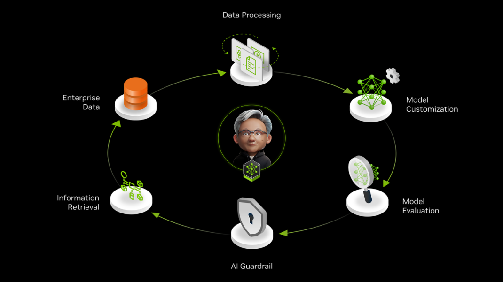

# NVIDIA Data Flywheel Helm Chart
This Helm chart deploys the [NVDIDIA Data Flywheel Blueprint](https://github.com/NVIDIA-AI-Blueprints/data-flywheel) and its associated services on HPE Private Cloud AI (PCAI) environments. 

| Owner                       | Name                              | Email                                     |
| ----------------------------|-----------------------------------|-------------------------------------------|
| Use Case Owner              | Daniel Cao                     | daniel.cao@hpe.com                      |
| PCAI Deployment Owner       | Daniel Cao                     | daniel.cao@hpe.com                      |

### Current status: 

- The chart spins up automatically and all the pods are running. 
- We tested starting a job from the notebook and could successfully create a job, monitor the job and deploy a custom inference endpoint.

## Demo Video
[](https://storage.googleapis.com/ai-solution-engineering-videos/public/Data_Flywheel_Demo.mp4)

## Prerequisites

1. Access to a PCAI cluster
2. NVIDIA API & NGC API keys
3. A deployed embedding model and/or LLM judge model if you prefer not to deploy those models locally
4. Hardware requirements: 2xL40S or better
5. Install volcano (I used 1.9 to match the blueprint) 

```sh
kubectl apply -f https://raw.githubusercontent.com/volcano-sh/volcano/release-1.9/installer/volcano-development.yaml
```

6. Create a new namespace "data-flywheel", edit the namespace to enable the label "istio-injection" for sidecar injection. Note that this namespace name needs to match the namespace specified in the data-flywheel's values.yaml. 

```sh
kubectl create ns data-flywheel
kubectl edit ns data-flywheel
```

```yaml
# Please edit the object below. Lines beginning with a '#' will be ignored,
# and an empty file will abort the edit. If an error occurs while saving this file will be
# reopened with the relevant failures.
#
apiVersion: v1
kind: Namespace
metadata:
  creationTimestamp: "2025-10-26T01:47:29Z"
  labels:
    istio-injection: enabled
    kubernetes.io/metadata.name: data-flywheel
  name: data-flywheel
  resourceVersion: "68975642"
  uid: 5a989056-2a9b-4bc5-a66f-f0fa0d0d969f
spec:
  finalizers:
  - kubernetes
status:
  phase: Active
```

## Modifications to the original data-flywheel's values.yaml (version 0.3.1)

1. [Required] Add the following part to configure virtualService. Note that the namespace configured here and on the UI has to be consistent - "data-flywheel"

```yaml
ezua:
  virtualService:
    endpoint: "data-flywheel.${DOMAIN_NAME}"
    istioGateway: "istio-system/ezaf-gateway"
  # if your cluster has self-signed certs, and you're using an MLIS endpoint, you'll need to enable this
  # to add the certs to the agent deployment so it can trust it
  #and then uncomment out the extrapod volume and args section below
  selfSignedCert: false
```

2. [Required] Set up namespace

```yaml
# Default values for data-flywheel.
# This is a YAML-formatted file.
# Declare variables to be passed into your templates.

namespace: "data-flywheel"
```

3. [Optional] Disable production profile if you want to enable kibana and Data Flywheel flower server

```yaml
# Deployment profile settings
# - For production profile, kibana and Data Flywheel flower server are disabled
#   For non-production profiles, kibana and Data Flywheel flower server are enabled
# - For mlflow profile (default), COMPOSE_PROFILES is "mlflow"
# - For non-mlflow profile, COMPOSE_PROFILES is "" (leave blank)
profile:
  production:
    enabled: false
  mlflow:
    COMPOSE_PROFILES: "mlflow"
```

4. [Required] Add generic service for NeMo Microservices virtualService routing
```yaml
  genericService:
    enabled: true
    fullnameOverride: "df-generic-service"
    service:
      type: ClusterIP
      # This service doesn't need a port - it's just a DNS entry for Istio
      # But Kubernetes requires at least one port, so we define a dummy one
      port: 8000
      # -- Annotations for Istio mesh integration
      labels: {}
```

5. [Required] Replace the default DNS hostnames using following Kubernetes services

```yaml
  config:
    nmp_config:
      nemo_base_url: "http://df-generic-service.data-flywheel.svc.cluster.local:8000"
      nim_base_url: "http://nemo-nim-proxy.data-flywheel.svc.cluster.local:8000"
      datastore_base_url: "http://nemo-data-store.data-flywheel.svc.cluster.local:3000"
```

6. [Optional] Select the logging config level

```yaml
    # Logging configuration
    logging_config:
      level: "DEBUG"  # Options: DEBUG, INFO, WARNING, ERROR, CRITICAL
```

7. [Required] Set up a remote LLM judge model. 

```yaml
    llm_judge_config:
      deployment_type: "remote"
      url: "https://integrate.api.nvidia.com/v1/chat/completions" # Replace integrate.api.nvidia.com with your model endpoint
      model_name: meta/llama-3.3-70b-instruct 
      # To spin up a dedicated NIM in your cluster, comment the above uncomment and fill these:
      # deployment_type: "local"
      # model_name: "meta/llama-3.3-70b-instruct"
      # context_length: 32768
      # gpus: 4
      # pvc_size: 25Gi
      # tag: "1.8.5"
```

Alternatively uncomment the local deployment option if you have sufficient GPU resources and want to use a local NIM model in your cluster.

```yaml
    llm_judge_config:
      # deployment_type: "remote"
      # url: "https://integrate.api.nvidia.com/v1/chat/completions" # Replace integrate.api.nvidia.com with your model endpoint
      # model_name: meta/llama-3.3-70b-instruct 
      # To spin up a dedicated NIM in your cluster, comment the above uncomment and fill these:
      deployment_type: "local"
      model_name: "meta/llama-3.3-70b-instruct"
      context_length: 32768
      gpus: 4
      pvc_size: 25Gi
      tag: "1.8.5"
```

8. [Required] Set up embedding model name and endpoint

**Note:** You should consider the dimension of the vector output for each model. Elasticsearch configuration expects a 2024-dimension vector, so **nvidia/llama-3.2-nv-embedqa-1b-v2** works but other embedding models such as **nvidia/nv-embedqa-e5-v5** might fail due to the dimension mismatch issue, resulting in a "Elasticsearch Bulk Indexing Error".

```yaml
    # ICL config:
    # max context length, reserved tokens, max examples, min examples
    # example_selection: "uniform_distribution" or "semantic_similarity"
    icl_config:
      max_context_length: 32768
      reserved_tokens: 4096
      max_examples: 3
      min_examples: 1
      example_selection: "semantic_similarity"
      similarity_config:
        relevance_ratio: 0.7
        embedding_nim_config:
          deployment_type: "remote"
          url: "your-embedding-model-endpoint/v1/embeddings" # Replace "your-embedding-model-endpoint" with your embedding model endpoint service
          model_name: "nvidia/llama-3.2-nv-embedqa-1b-v2"
          # deployment_type: "local"
          # model_name: "nvidia/llama-3.2-nv-embedqa-1b-v2"
          # context_length: 32768
          # gpus: 1
          # pvc_size: "25Gi"
          # tag: "1.9.0"
```

Alternatively, you can use a locally deployed embedding model by uncommenting the local deployment option.

```yaml
          deployment_type: "local"
          model_name: "nvidia/llama-3.2-nv-embedqa-1b-v2"
          context_length: 32768
          gpus: 1
          pvc_size: "25Gi"
          tag: "1.9.0"
```

9. [Required] Replace the default DNS hostnames with the correct cluster service url and domain.

```yaml
    external:
      rootUrl: http://nemo-data-store.data-flywheel.svc.cluster.local
      domain: nemo-data-store.data-flywheel.svc.cluster.local:3000
```

10. [Required] Set up a Virtual Service using the DNS entry created by the generic service above to route traffic to different services.

```yaml
  virtualService:
    enabled: true
    main:
      hosts: ["df-generic-service.data-flywheel.svc.cluster.local"]
    additional:
      data-store:
        hosts: ["df-data-store.data-flywheel.svc.cluster.local"]
      nim-proxy:
        hosts: ["nim-proxy.data-flywheel.svc.cluster.local"]
```

11. [Optional] Specify a storage class option available on your system, ex., "gl4f-filesystem". Alternatively leave the value empty "", it will pick up the default storage class in your system.  

```yaml
    modelsStorage:
      storageClassName: "" 
```

## Assessment of completion

 On the Jupyter Notebook, after you've created a new job in **Step 2: Create a Flywheel Job**, in **Step 3: Monitor Job Status**, when running *get_job_status(job_id)*, a successful deployment and finetuning completion should look like this:

```yaml
{'id': '68feb303718f50e69f7092fd',
 'workload_id': 'primary_assistant',
 'client_id': 'aiva-1',
 'status': 'completed',
 'started_at': '2025-10-26T23:47:15.078000',
 'finished_at': '2025-10-27T00:12:21.498000',
 'num_records': 1000,
 'llm_judge': {'model_name': 'meta/llama-3.3-70b-instruct',
  'type': 'remote',
  'deployment_status': 'ready',
  'error': None},
 'nims': [{'model_name': 'meta/llama-3.2-1b-instruct',
   'status': 'completed',
   'deployment_status': 'completed',
   'runtime_seconds': 1427.526516,
   'evaluations': [{'eval_type': 'base-eval',
     'scores': {'function_name': 0.67,
      'function_name_and_args_accuracy': 0.0,
      'tool_calling_correctness': 0.32},
     'started_at': '2025-10-26T23:49:41.829000',
     'finished_at': '2025-10-26T23:55:38.451000',
     'runtime_seconds': 357.795228,
     'progress': 100.0,
     'nmp_uri': 'http://df-generic-service.data-flywheel.svc.cluster.local:8000/v1/evaluation/jobs/eval-CFXFxdeVhTvtozWvVTWUxb',
     'mlflow_uri': 'http://df-mlflow-service:5000/#/experiments/329097649281186183',
     'error': None},
    {'eval_type': 'icl-eval',
     'scores': {'function_name': 0.61,
      'function_name_and_args_accuracy': 0.0,
      'tool_calling_correctness': 0.49},
     'started_at': '2025-10-26T23:49:41.838000',
     'finished_at': '2025-10-26T23:55:48.483000',
     'runtime_seconds': 367.692783,
     'progress': 100.0,
     'nmp_uri': 'http://df-generic-service.data-flywheel.svc.cluster.local:8000/v1/evaluation/jobs/eval-G82ytsJZnxBYMXe5auKCEp',
     'mlflow_uri': 'http://df-mlflow-service:5000/#/experiments/329097649281186183',
     'error': None},
    {'eval_type': 'customized-eval',
     'scores': {'function_name': 0.96,
      'function_name_and_args_accuracy': 0.03,
      'tool_calling_correctness': 0.65},
     'started_at': '2025-10-27T00:05:44.170000',
     'finished_at': '2025-10-27T00:11:20.400000',
     'runtime_seconds': 337.252212,
     'progress': 100.0,
     'nmp_uri': 'http://df-generic-service.data-flywheel.svc.cluster.local:8000/v1/evaluation/jobs/eval-V17GairUbr5hzU1X6uzLCB',
     'mlflow_uri': 'http://df-mlflow-service:5000/#/experiments/329097649281186183',
     'error': None}],
   'customizations': [{'started_at': '2025-10-26T23:49:41.838000',
     'finished_at': '2025-10-27T00:05:44.156000',
     'runtime_seconds': 962.317619,
     'progress': 100.0,
     'epochs_completed': 2,
     'steps_completed': 102,
     'nmp_uri': 'http://df-generic-service.data-flywheel.svc.cluster.local:8000/v1/customization/jobs/cust-MeF6t3ao9CNoDmxL2tvYgP',
     'customized_model': 'dfwbp/customized-meta-llama-3.2-1b-instruct@cust-MeF6t3ao9CNoDmxL2tvYgP',
     'error': None}],
   'error': None}],
 'datasets': [{'name': 'flywheel-eval-primary_assistant-1761522435',
   'num_records': 100,
   'nmp_uri': 'hf://datasets/dfwbp/flywheel-eval-primary_assistant-1761522435'},
  {'name': 'flywheel-icl-primary_assistant-1761522435',
   'num_records': 100,
   'nmp_uri': 'hf://datasets/dfwbp/flywheel-icl-primary_assistant-1761522435'},
  {'name': 'flywheel-train-primary_assistant-1761522435',
   'num_records': 810,
   'nmp_uri': 'hf://datasets/dfwbp/flywheel-train-primary_assistant-1761522435'}],
 'error': None}
```

After finetuning completes, in **Step 5: Deploy Customized Model and Run Inference** on the notebook, deploy the base LLama-3.2-1B-instruct model. This will take about ~5 mins. 

```sh
200
{'async_enabled': False, 'config': {'model': 'meta/llama-3.2-1b-instruct', 'nim_deployment': {'additional_envs': {'NIM_GUIDED_DECODING_BACKEND': 'outlines'}, 'gpu': 1, 'image_name': 'nvcr.io/nim/meta/llama-3.2-1b-instruct', 'image_tag': '1.8', 'disable_lora_support': False}}, 'created_at': '2025-10-27T00:27:13.571436808Z', 'deployed': False, 'name': 'llama-3.2-1b-instruct', 'namespace': 'meta', 'status_details': {'description': 'Model deployment created', 'status': 'pending'}, 'url': ''}
```

When running inference against the deployed finetuned model. The results should look like this.

```sh
{'role': 'assistant',
 'content': None,
 'tool_calls': [{'id': 'chatcmpl-tool-950d59a48fb44adc93f6835cff2437cb',
   'type': 'function',
   'function': {'name': 'ToProductQAAssistant',
    'arguments': '{"query": "What is the sizing, material, and shrinkage of the tri tee?"}'}}]}
```

## Import framework:

1. Access the HPE AI Essentials portal
2. Click the Tools & Frameworks icon on the left navigation bar
3. Click + Import Framework.
- Choose a Framework name, ex., NVIDIA Data Flywheel Blueprint
- Description 
- Category: of your choice, for example Data Science.
- Framework Icon: Click Select File and select the icon logo file in this repo
- Helm Chart: Choose the packaged .tgz chart file in this repo
- Namespace: "data-flywheel". Make sure that this is identical to the namespace specified in the helm chart's values.yaml
- Release: Optional

## Additional Notes

-For details on importing arbitrary custom frameworks into Private Cloud AI, follow the steps in the [HPE documentation for importing applications as custom frameworks](https://support.hpe.com/hpesc/public/docDisplay?docId=a00aie16hen_us&page=ManageClusters/importing-applications.html) 
