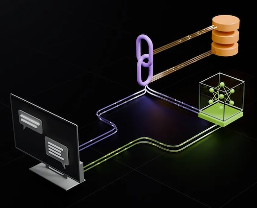

# NVIDIA Enterprise RAG
This Helm chart deploys the [NVIDIA Enterprise RAG Blueprint](https://build.nvidia.com/nvidia/build-an-enterprise-rag-pipeline) and its associated services on HPE Private Cloud AI (PCAI) environments.

## Demo Video
[](https://storage.googleapis.com/ai-solution-engineering-videos/public/Enterprise-RAG-Blueprint-Demo.mp4)

## Prerequisites
1. Access to an a PCAI cluster
2. Administrative privileges to import custom frameworks
3. NGC API key (to access container images)
4. NVIDIA API key (to access NVIDIA API endpoints)
5. Hardware requirements

    | Deployment                    | GPU Requirements  | Details                                                               |
    |-------------------------------|-------------------|-----------------------------------------------------------------------|
    | 2.1.0-hybrid                  | 7xL40S or better  | Hybrid deployment leveraging Local models and NVIDIA API Endpoints    |


## Configuration
- Setup required environment variables
    ```
    export NAMESPACE='nv-nvidia-blueprint-rag'
    export NGC_API_KEY=<ngc-api-key-to-pull-images>
    export NVIDIA_API_KEY=<nvidia-api-key-to-use-nvidia-api>
    ```

- Create namespace (if not already created)
    ```
    kubectl create namespace $NAMESPACE
    ```
- Create secrets
    ```
    kubectl create secret docker-registry ngc-secret --docker-server=nvcr.io --docker-username='$oauthtoken' --docker-password=$NGC_API_KEY -n $NAMESPACE
    kubectl create secret generic ngc-api --from-literal=NGC_API_KEY=$NVIDIA_API_KEY --from-literal=NGC_CLI_API_KEY=$NVIDIA_API_KEY -n $NAMESPACE
    ```

## Import Framework
1. Log in to the HPE AI Essentials web interface.

2. Click the **Tools & Frameworks** icon on the left navigation bar.

3. Click **+ Import Framework**.

- **Framework Name**: of your choice, for example `NVIDIA Enterprise RAG`.
- **Description**: of your choice, for example `NVIDIA Enterprise RAG Blueprint`.
- **Category**: of your choice, for example `Data Science`.
- **Framework Icon**: Click `Select File` and select the icon you want to use, e.g. the logo file in this repo.
- **Helm Chart**: Choose the packaged `.tgz` chart file in the parent folder.
- **Namespace**: where you created your secrets in, for example `nv-nvidia-blueprint-rag`
- **Release**: of your choice, for example `rag`

## Additional Notes
* For details on importing arbitrary custom frameworks into Private Cloud AI, follow the steps in the [HPE documentation for importing applications as custom frameworks](https://support.hpe.com/hpesc/public/docDisplay?docId=a00aie16hen_us&page=ManageClusters/importing-applications.html)
