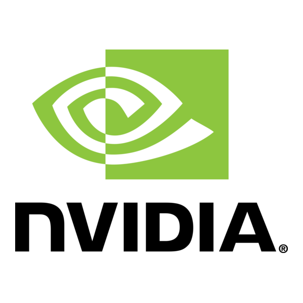

# Omniverse Real Time Digital Twin for Fluid Dynamics

This Helm chart deploys the [Nvidia Omniverse Blueprint for Real-time Computer-aided Engineering Digital Twins](https://github.com/NVIDIA-Omniverse-blueprints/digital-twins-for-fluid-simulation) and its associated services on HPE Private Cloud AI (PCAI) environments.

| Owner                       | Name                                   | Email                                                     |
| ----------------------------|----------------------------------------|-----------------------------------------------------------|
| Use Case Owner              | Jeff Oxenberg | jeff.oxenberg@hpe.com    |
| PCAI Deployment Owner       | Jeff Oxenberg | jeff.oxenberg@hpe.com    |

# Demo Video

[](https://storage.googleapis.com/ai-solution-engineering-videos/public/omniverse_dtfd_demo_video.mp4)

## Prerequisites

1. Access to an a PCAI cluster with GPUs supporting Graphics libraries (RTX Pro 6000, L40S)
2. Administrative privileges to import custom frameworks
3. `kubectl` access to run preparation tasks
4. NGC API key (to access AeroNIM container image)
5. PCAI worker nodes are accessible from client machine

## Preparation
### Container build
Build and push the containers as per the [official documentation](https://github.com/NVIDIA-Omniverse-blueprints/digital-twins-for-fluid-simulation).

### System changes
Due to an issue with the precompiled drivers shipped with AIE 1.11 not containing graphics libraries, it's necessary to switch to runtime-compiled drivers. If you are not on AIE 1.11, attempt to run the blueprint prior to making any GPU Operator changes.

If you are affected by this issue, you will see the following error in the kit app:
```
root@ez-master01:/home/pcadmin/rtdt-helm# k logs rtdt-fluid-sim-kit-7b68889844-fvcfw -n rtdt
Defaulted container "kit" out of: kit, wait-for-aeronim (init)

Fatal Error: Can't find libGLX_nvidia.so.0...

Ensure running with NVIDIA runtime. (--gpus all) or (--runtime nvidia)
```

To switch drivers, first take a backup of the clusterpolicy, then patch it:
```
k get clusterpolicies.nvidia.com cluster-policy -oyaml > clusterpolicy.yaml

kubectl patch clusterpolicies.nvidia.com/cluster-policy --type='json' -p='[
  {"op": "replace", "path": "/spec/driver/usePrecompiled", "value": false},
  {"op": "replace", "path": "/spec/driver/version", "value": "575.57.08"}
]'
```

Ensure that the NVIDIA driver daemonset restarts
```
nvidia-driver-daemonset-fth5m                        1/1     Running   0             5d
```


## Configuration

1. **Import as Custom Framework**:
   Follow the steps in the [HPE documentation for importing applications as custom frameworks](https://support.hpe.com/hpesc/public/docDisplay?docId=a00aie16hen_us&page=ManageClusters/importing-applications.html):

   a. Log in to the HPE AI Essentials web interface.
   
   b. Click the **Tools & Frameworks** icon on the left navigation bar.
   
   c. Click **+ Import Framework**. Navigate through each step within the Import Framework wizard:

       Framework Details: 
        Set the following boxes on the Framework Details step:
        Framework Name: Omniverse Digital Twin for Fluid Dynamics

        Description: Omniverse Digital Twin for Fluid Dynamics 

        Category: Data Science

        Framework Icon: Click Select File and select logo.png from this repo
        
        Helm Chart: Choose the packaged chart file (.tgz) in this repo
        
        Namespace: rtdt        
    
    
**Framework Values:**
 Configure the override values file of your application by using the Helm Values (YAML) box. An example is provided in `values-override.yaml`

## Access
When the Framework finishes installation, it will be available to open as a tile in the Frameworks page, however clicking **Open** will result in a 404 error. After clicking Open, modify the URL to use *http* vs *https*, then modify the server parameter with the correct host name or IP address for your installation. This can be found with the following procedure:

Use `kubectl get po -n rtdt -owide` to get the host name of the server running the kit app pod. Then, use `kubectl get no -owide` to get that node's IP (if your client system does not have DNS resolution for your worker nodes). Use this host name or IP address in the **server** paramter in the URL.
