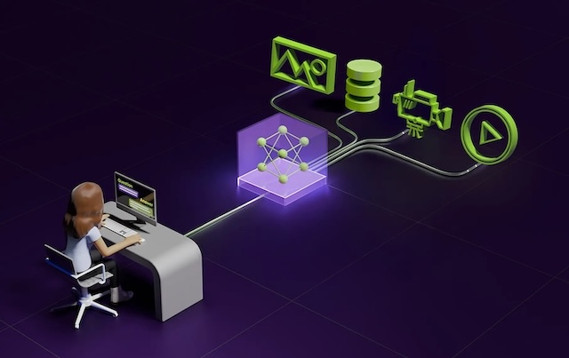

# NVIDIA Video Search and Summarization Agent
This Helm chart deploys the NVIDIA Video Search and Summarization Agent Blueprint https://github.com/NVIDIA-AI-Blueprints/video-search-and-summarization and its associated services on HPE Private Cloud AI (PCAI) environments.

| Owner                       | Name                              | Email                                     |
| ----------------------------|-----------------------------------|-------------------------------------------|
| Use Case Owner              | Tanguy Pomas                      | tanguy.pomas@hpe.com                      |
| PCAI Deployment Owner       | Tanguy Pomas                      | tanguy.pomas@hpe.com                      |

## Demo Video
[](https://storage.googleapis.com/ai-solution-engineering-videos/public/NVIDIA-VSS-demo.mp4)


## Prerequisites
1. Access to an a PCAI cluster
2. Administrative privileges to import custom frameworks
3. NGC API key (to access both container images and NVIDIA API endpoints)
4. Hardware requirements

    | Deployment                    | GPU Requirements  | Details                                                               |
    |-------------------------------|-------------------|-----------------------------------------------------------------------|
    | 2.3.0-hybrid                  | 3xL40S or better  | Hybrid deployment leveraging Local models and NVIDIA API Endpoints    |

## Configuration
- Setup required environment variables
    ```
    export NAMESPACE=<namespace-to-deploy-to>
    export NGC_API_KEY=<your-ngc-api-key>
    export NEO4JUSERNAME=neo4j
    export NEO4JPASSWORD=password
    ```
- Create namespace (if not already created)
    ```
    kubectl create namespace $NAMESPACE
    ```
- Create secrets
    ```
    kubectl create secret docker-registry ngc-docker-reg-secret --docker-server=nvcr.io --docker-username='$oauthtoken' --docker-password=$NGC_API_KEY -n $NAMESPACE
    kubectl create secret generic ngc-api-key-secret --from-literal=NGC_API_KEY=$NGC_API_KEY -n $NAMESPACE
    kubectl create secret generic graph-db-creds-secret --from-literal=username=$NEO4JUSERNAME --from-literal=password=$NEO4JPASSWORD -n $NAMESPACE
    ```

## Import Framework
1. Log in to the HPE AI Essentials web interface.

2. Click the **Tools & Frameworks** icon on the left navigation bar.

3. Click **+ Import Framework**.

- **Framework Name**: of your choice, for example `NVIDIA VSS`.
- **Description**: of your choice, for example `NVIDIA VSS`.
- **Category**: of your choice, for example `Data Science`.
- **Framework Icon**: Click `Select File` and select the icon you want to use, e.g. the logo file in this repo.
- **Helm Chart**: Choose the packaged `.tgz` chart file in the parent folder.
- **Namespace**: where you created your secrets in, for example `vss`
- **Release**: of your choice, for example `vss`

## Additional Notes
* The cert-copy.yaml in the subfolder templates/ezua is only required for environments with AIE 1.6 using self-signed * certificates. 
* For details on importing arbitrary custom frameworks into Private Cloud AI, follow the steps in the [HPE documentation for importing applications as custom frameworks](https://support.hpe.com/hpesc/public/docDisplay?docId=a00aie16hen_us&page=ManageClusters/importing-applications.html)
